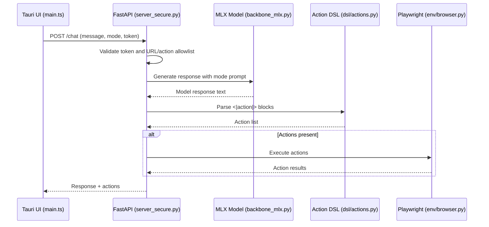

# Naeyla XS Architecture Tour

This is a concise, end-to-end walkthrough of how Naeyla runs locally and how the main pieces connect.

## Top-Level Layout

- `app/server_secure.py`  
  FastAPI server. Auth, request routing, action validation, audit logging, and runtime wiring to model + browser.
- `model/backbone_mlx.py`  
  Loads Qwen 2.5 1.5B via MLX and formats the chat prompt.
- `model/tokens.py` and `model/browser_prompts.py`  
  System prompts for the three modes and browser-enabled runs.
- `dsl/actions.py`  
  Action DSL and parser for `<|action|>` blocks.
- `env/browser.py`  
  Playwright controller that executes validated actions.
- `app/memory/embeddings.py` and `app/memory/database.py`  
  Memory storage and semantic search using sentence-transformers + SQLite.
- `tauri-app/naeyla-native/src/main.ts`  
  Frontend UI, sends authenticated requests to the backend.

## Runtime Flow (Chat)

1. Frontend sends `POST /chat` to `http://localhost:7861`.
2. `app/server_secure.py` validates the token and builds request context.
3. `model/backbone_mlx.py` generates a response using the mode prompt.
4. `dsl/actions.py` parses any `<|action|>` blocks.
5. `env/browser.py` executes allowed actions (navigate, click, type, etc.).
6. The server returns a response payload to the UI.

## Sequence Diagram

## Auth and Tokens

- Backend reads `NAEYLA_TOKEN` from `.env` at repo root.
- Frontend expects `VITE_NAEYLA_TOKEN` (typically in `tauri-app/naeyla-native/.env.local`).
- `app/server_secure.py` accepts the token via query param or `Authorization: Bearer ...`.

## Browser Actions

- Allowed actions are whitelisted in `app/server_secure.py` (`ALLOWED_ACTIONS`).
- URLs are validated to block localhost and non-HTTP(S) schemes.
- Playwright runs in `env/browser.py` (non-headless by default).

## Memory System

- `app/memory/embeddings.py` embeds text with `sentence-transformers`.
- Embeddings and messages live in a SQLite DB at `data/memory.db`.
- Search uses cosine similarity over stored embeddings.

## Developer Entry Points

- Backend: `uvicorn app.server_secure:app --host 127.0.0.1 --port 7861 --reload`
- Frontend: `cd tauri-app/naeyla-native && npm run tauri dev`
- Combined: `./run_dev.sh`
